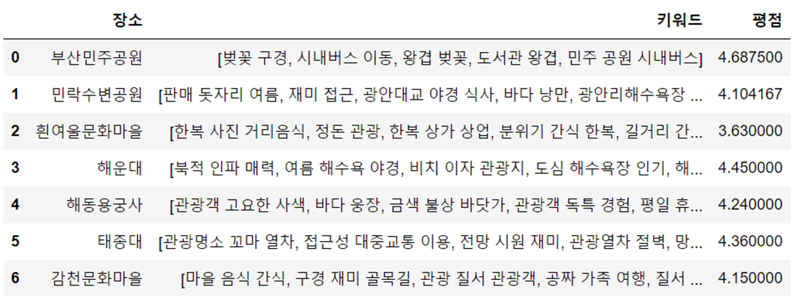
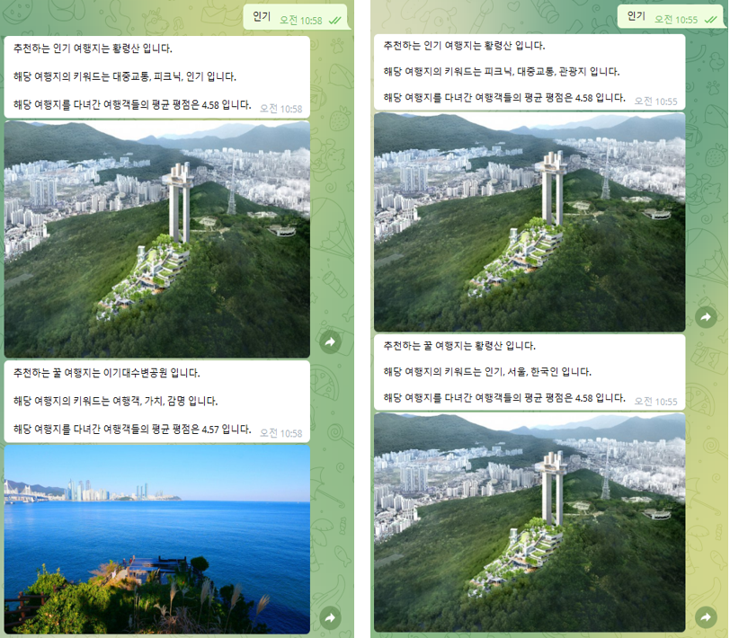

# 상쾌한

## 쾌적한 휴가를 위한 여행지 추천 챗봇
### 챗봇에게 이번 여행의 키워드를 알려주세요.

1. 사회적 거리두기 해제 및 코로나 19확진자 감소세, 6~8월 여름 휴가철 성수기 등으로 관광 수요급증 예상, 여행지 관련 서비스 제작
2. 여름철, 계절별 여행지, 꿀여행지를 주제로 서비스를 기획
3. 사용자가 여행의 키워드를 입력하면 그에 해당하는 인기 여행지와 꿀여행지를 추천

### 개발인원 : 5명

### 담당역할 : 여행장소 및 리뷰 데이터 수집, 수집된 여행 리뷰 데이터 병합, 여행 장소 리뷰 내 키워드 추출, 꿀 여행지 알고리즘 개발

### 개발환경
#### 언어 : Python
#### IDE : Pycharm, Jupyter Notebook

### 기술 스택 : Selenium, KeyBERT, Telegram

### 크롤링 사이트 : Naver, 트릿닷컴, 대한민국구석구석, 구글맵, 트립어드바이저 등

### 프로젝트 진행 순서
1. 데이터 수집 : 여행장소 List 및 여행 리뷰 Data 크롤링
2. 데이터 처리 : 각 여행 정보 사이트 Data 병합 및 정제 후 키워드 추출
3. 데이터 분석 : 추출 키워드를 통한 여행지 추천
4. 데이터 시각화 : 텔레그램 챗봇을 이용한 여행지 정보 공유

### 상세과정
1. 데이터 수집(1) : 크롤링 라이브러리 Selenium을 사용하여 ‘NAVER’와 ‘대한민국 구석구석’ 사이트에서 부산여행 장소 List를 수집합니다.

2. 데이터 수집(2) : 크롤링 라이브러리 Selenium을 사용하여 ‘Google Map’과 ‘트립어드바이저’, ‘트립닷컴’ 사이트에서 여행 장소 List별 리뷰를 수집합니다.

- 데이터 수집 간 이슈
    - 관광지 리스트에 있는 부산 내 관광지가 아닌 다른 장소로 검색 -> 관광지 위치에 부산이 존재하면 리뷰를 크롤링 할 수 있도록 설정
    - 검색한 여행지와 다른 여행지가 조회되거나 여행지 정보가 없는 경우 -> 해당 장소 리뷰 수집 생략
    

3. 데이터 처리(1) : 각각의 여행 정보 사이트에서 수집된 리뷰들을 여행 장소 List별로 병합합니다.

4. 데이터 처리(2) : 리뷰 Data 전처리 후 Key BERT를 활용하여 리뷰에서 중요한 키워드를 추출합니다.
- 전처리 과정
    - 평점이 없는 Data -> 평균값 대체
    - 리뷰 수가 현저히 적은 경우나 리뷰가 없는 경우 ->적합한 여행지 추천을 위해 제외
    - 한국어가 아닌 리뷰(한국어로 번역) -> 번역이 잘못된 경우를 고려하여 제외
    - Word-Cloud를 사용 -> 불용어 설정(제거)
    

5. 데이터 분석 및 시각화 : 입력 키워드에 해당하는 인기 여행지 및 꿀 여행지* 추천을 위한 데이터 분석을 합니다.
*꿀 여행지는 리뷰 수는 상대적을 적지만 평점이 높은 장소를 점수로 산정하여 추천합니다.
텔레그램 챗봇을 이용하여 키워드 입력 시 이에 해당하는 인기 여행지와 꿀 여행지에 대한 정보 및 사진을 제공합니다.
- 데이터 분석 간 이슈(프로젝트 기간 한계)
    - 지도 API 연동을 통한 실시간 혼잡도 Data를 활용하여 관광지 별 혼잡도 정보제공으로 상쾌한 관광지를 추천하는 기능을 고려
    - 데이터 프레임 내에 없는 키워드가 입력되면 오류가 발생하여 입력 받은 키워드와 유사도가 높은 키워드를 반환하는 기능을 고려

- 개선사항
    - 입력 키워드에 대한 적절한 여행 장소 미제공시 데이터 프레임 내에서 빈도가 높은 키워드를 사용자에게 재 추천하여 사용자가 다른 키워드를 입력하도록 유도
    - 추천된 여행지가 인기 여행지와 꿀 여행지가 동일할 시 꿀 여행지 알고리즘에서 두번째로 높은 점수를 받은 관광지를 추천
    